# Taller APIs y GraphQL
## Nombre: Juan Felipe Fajardo Garzón

## API

1. Elegir UNA API de la lista

API elegida: Pokemon https://pokeapi.co/api/v2/pokemon

Variables de entorno usadas (url_base y pkmn_name)

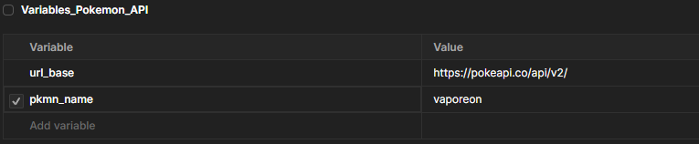

2. En Postman crear mínimo 5 requests:
   - GET todos los recursos, usamos /pokemon

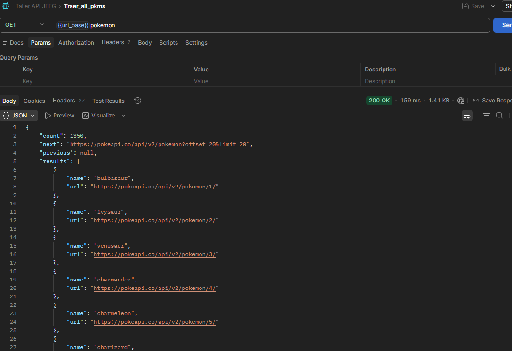


- GET uno por ID o filtro

Traer Las características de un pokemón por su nombre, en este ejemplo se usa vaporeon, se hace uso de /pokemon/nombre

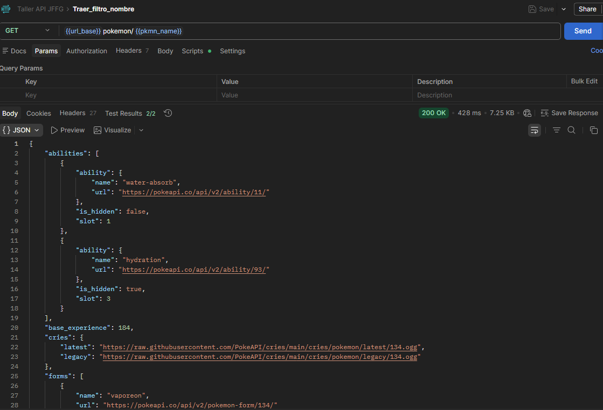

En este otro ejemplo se trae toda la información relacionada a cierto tipo de pokemón (fuego), en este caso se usa /type/tipo

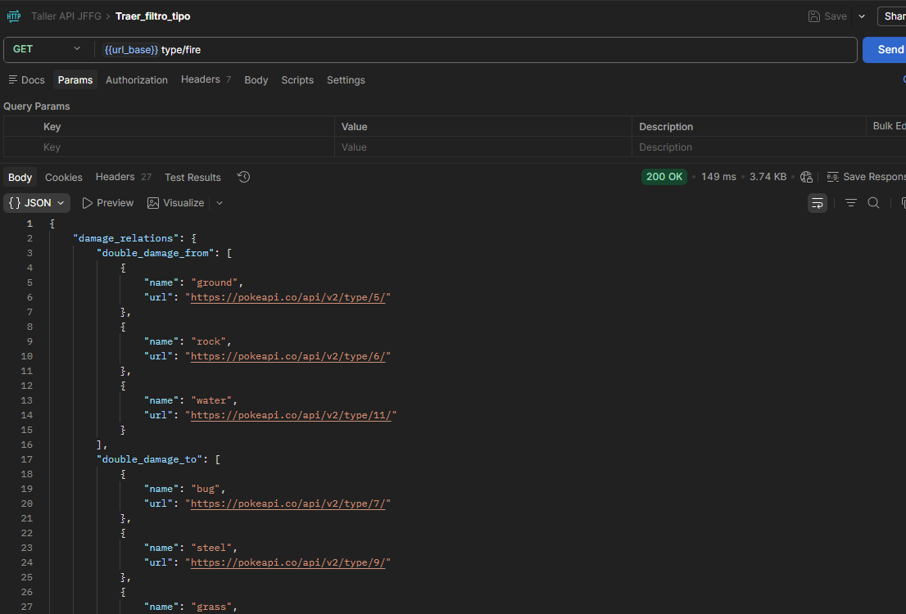

Finalmente se trae algún movimiento por su nombre, se usa el endpoint /move/nombre (en el ejemplo se muestra la información del movimiento danza dragón)

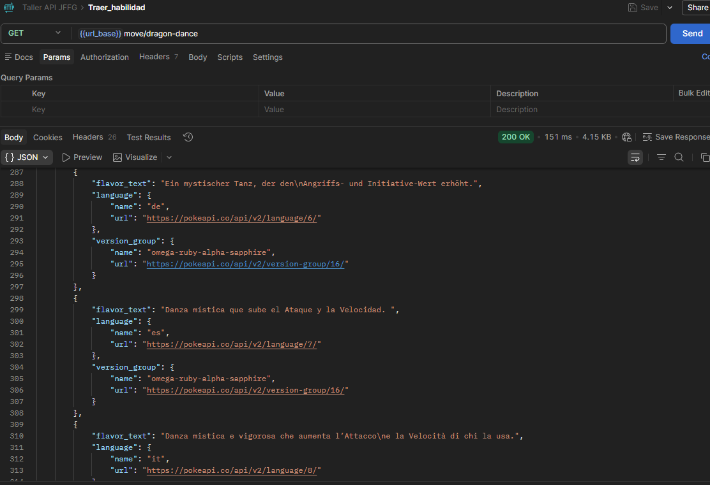


   - Si tiene POST → crear uno

Esta API no cuenta con post

   - Usar query params en al menos una request

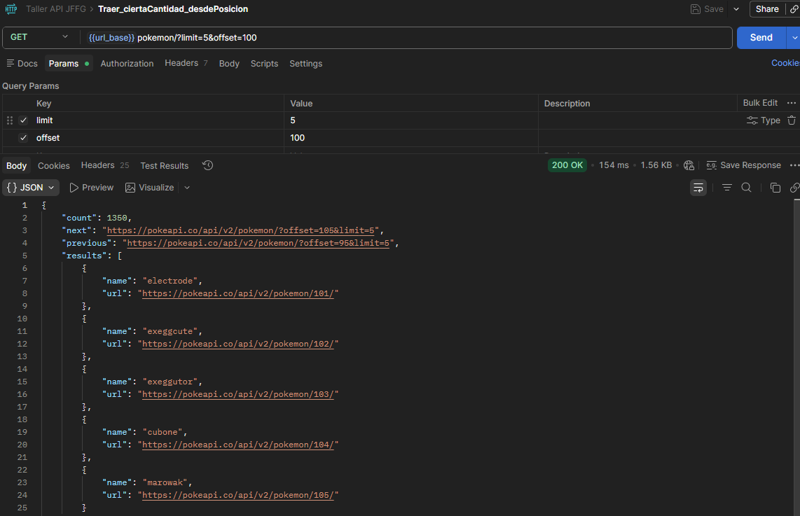

En este ejemplo se usan las query params limit y offset, limit es para traer cierta cantidad de resultados, en este caso se traen 5 pkmns; por su parte offset indica en qué índice de la lista de los pkmns comenzar, se usa 100


 - Escribir mínimo 2 tests automáticos

Se van a hacer uso de un test que verifica el status code igual a 200, y otro que verifica en la request filtrada por nombre, que el nombre del pokemon traído si sea el esperado

```js
pm.test("Status code es 200", function () {
    pm.response.to.have.status(200);
});

pm.test("El nombre devuelto coincide con la variable de entorno", function () {
    var jsonData = pm.response.json();
    var expectedName = pm.environment.get("pkmn_name");
    pm.expect(jsonData.name).to.eql(expectedName.toLowerCase());
});
```

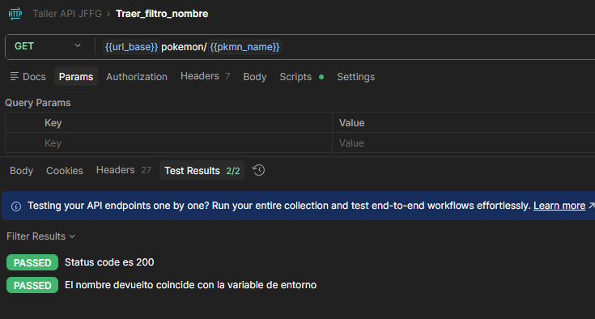

3. Exportar la colección como .json

[Entregable coleccion API](Taller_API_JFFG.postman_collection.json)


4. Responder:
   → ¿Qué API elegiste y por qué?

Elegí el API de pokemón porque me gusta bastante pokemón y es interesante ver una base de datos que contenga tanta información como esta, en ella se pueden encontrar ataques, bayas, incluso spawns en diferentes generaciones o juegos

Puede llegar a ser interesante para una IA que sepa jugar pokemón

   → ¿Qué datos devuelve?

En su mayoría son strings como nombres o descripciones, sin embargo también tiene datos como stats de ataque, defensa, vida, etc.  

   → ¿Usa token o no? ¿Qué tipo?

No usa Token

   → ¿Qué código de estado recibiste en cada request?

En todos los request recibí un 200

   → ¿Qué aprendiste diferente a JSONPlaceholder?

A diferencia de JSONPlaceholder, la API de pokemón contiene información “útil” o que puede ser usada para algún propósito, además de esto, contiene múltiples anidaciones (mientras que JSONplaceholder es bastante plano) lo cual le da mucha más profundidad y estructura a la API

## GraphQL

Finalmente con GraphQL con Postman

API a usar: https://countries.trevorblades.com/graphql

Requisitos mínimos:
1. Crear una colección en Postman llamada "Tarea GraphQL - [Nombre]"

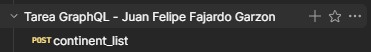

2. Mínimo 5 requests con queries diferentes

Query que trae nombre y código de todos los continentes

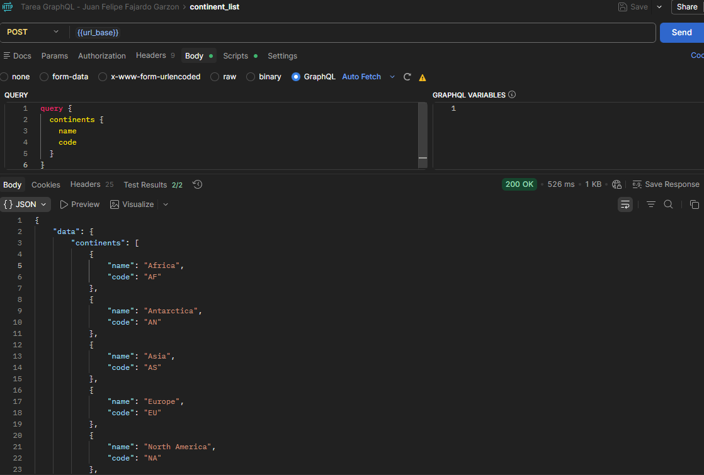

Query que trae nombre y código de todos los idiomas disponibles

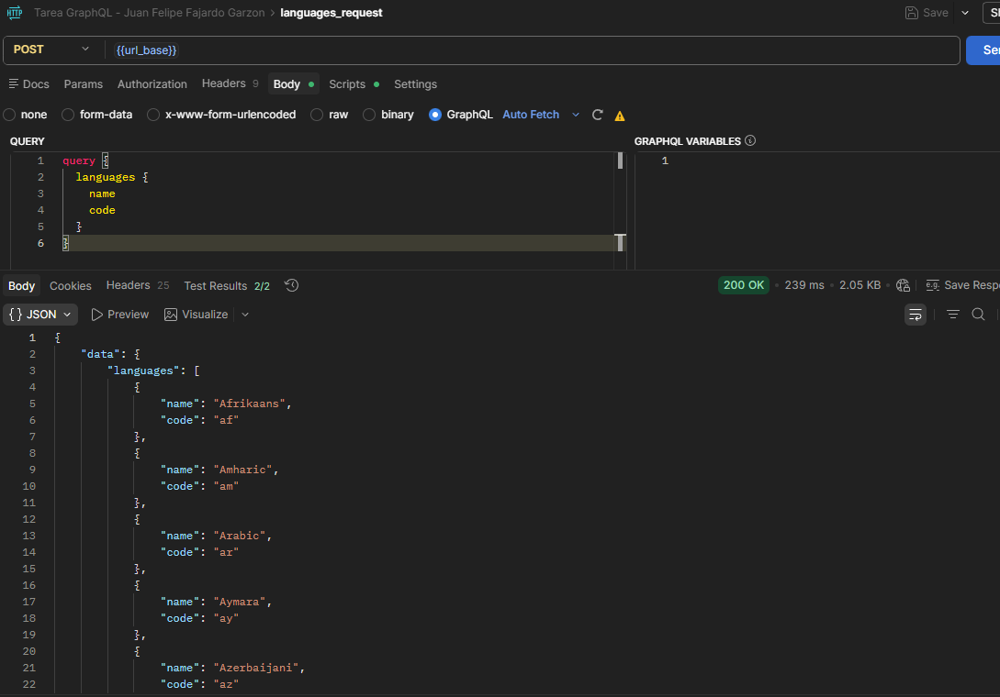

3. Al menos una query anidada (datos relacionados)

Query anidada que consulta a Estados Unidos por su código (US), allí trae el código y nombre del lenguaje, y el código y nombre de todos los estados

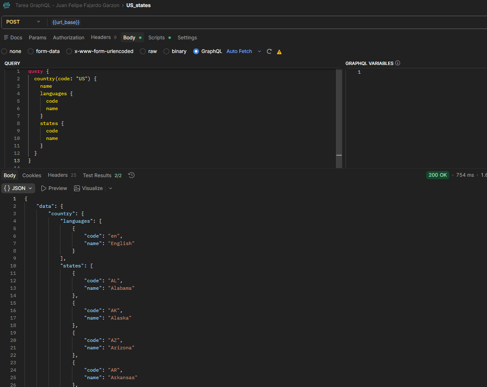

query que trae todos los países de cada continente y luego todos los estados (si es que tiene) de ese país

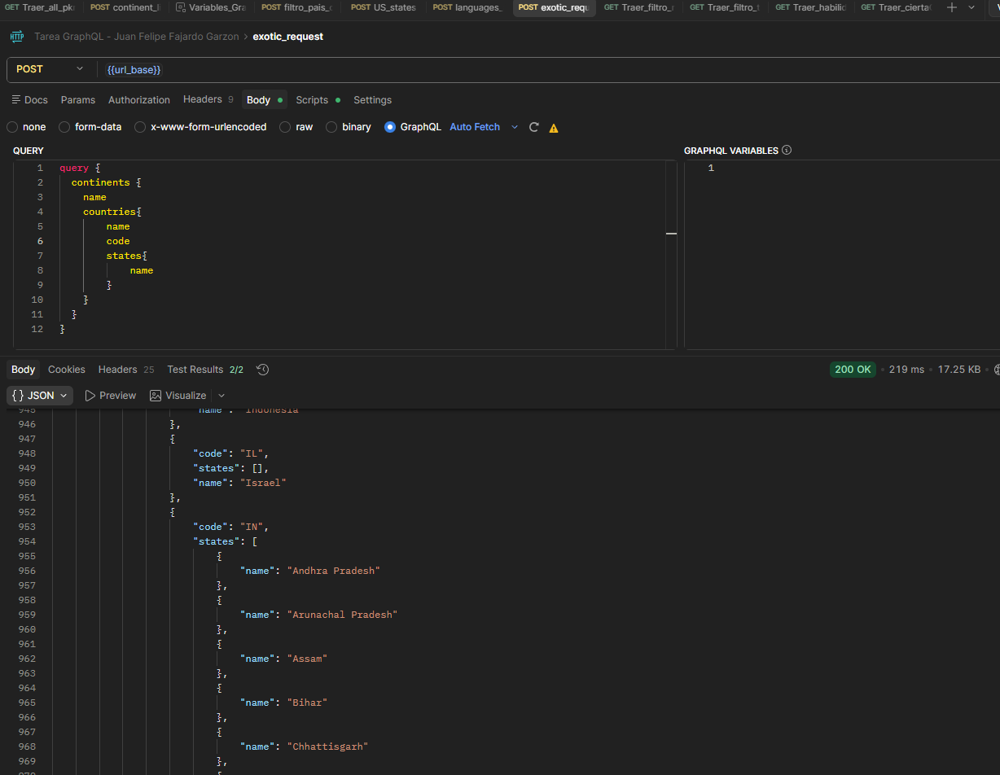

4. Al menos una query con filtro por argumento

Buscar un país por su código y traer información varia

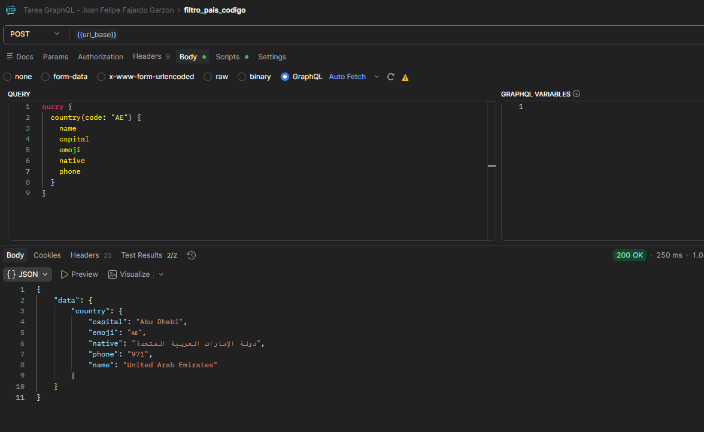

5. Mínimo 2 tests automáticos por request

En cada request se valida que el código HTTP sea 200, además de esto, cada request contiene un test personalizado:

### Continent_list

Este test verifica que la respuesta sea un arreglo de continentes, además que cada uno cuente con su nombre y código

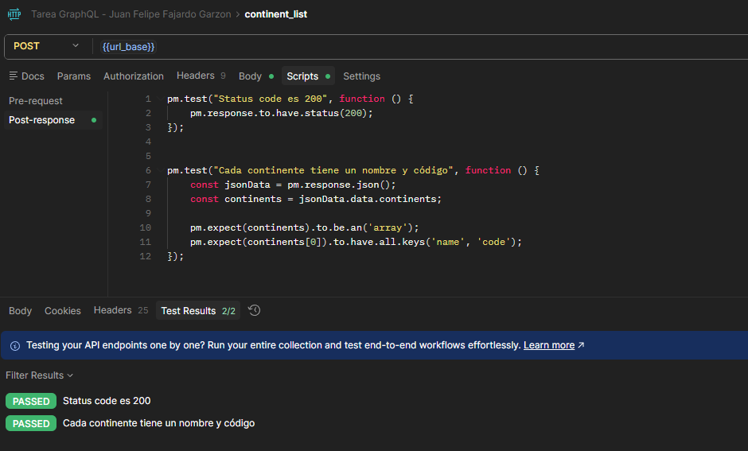

### Filtro País

El test personalizado verifica que la respuesta contenga un valor y este sea un string

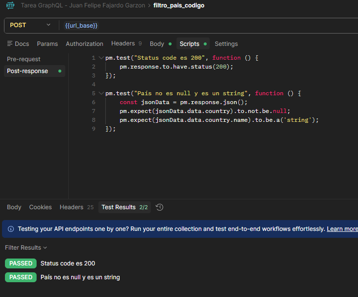

### US_States

El test verifica que la lista de estados contenga elementos

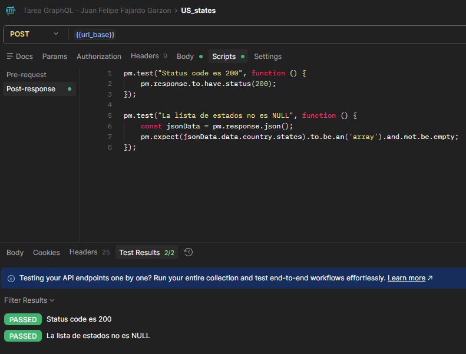

### Languages Request

Se verifica que los códigos de lenguaje contengan únicamente 2 letras, (el formato correcto)

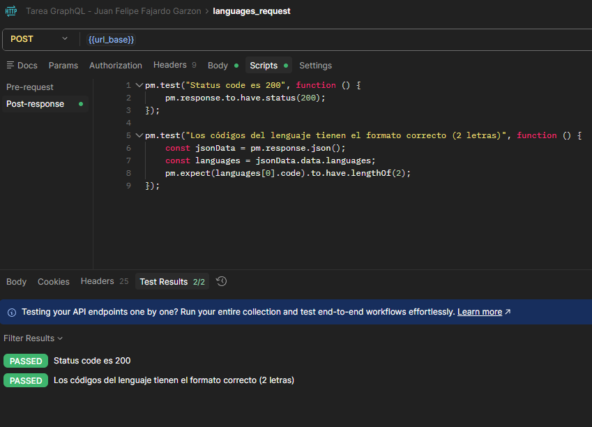


### Exotic request

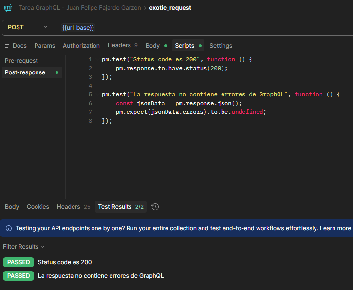


El test verifica que no hayan errores de GraphQL en la respuesta


Entregables:
- Colección exportada como .json

[Colección GraphQL](Tarea_GraphQL-Juan_Felipe_Fajardo_Garzon.postman_collection.json)

- Captura de pantalla de cada request con su respuesta
- Documento respondiendo:
   * ¿Qué diferencia encontraste vs REST?

Que con GraphQL no es necesario cambiar la URL, únicamente la estructura de la query, de esta forma se puede encontrar diferente información en un solo endpoint

   * ¿Cuántos requests REST necesitarías para
     reemplazar tu query más compleja?

Mi query más compleja considero que es es Exotic_query y necesitaría al menos 3 API Rest para reemplazarla

   * ¿En qué proyecto real usarías GraphQL?

Podría ser utilizado para dashboards que contengan múltiple información de diferentes dependencias, de esta forma se puede acceder a todas las dependencias sin cambiar de endpoint en el backend
