# Taller APIs y SSH
## Nombre: Juan Felipe Fajardo Garzón

Para esta práctica se hizo uso de una maquina virtual ubuntu en virtualBox, donde descargamos todos los archivos necesarios para ejecutar la API en la maquina virtual (incluyendo node js)

Primeramente en la máquina virtual revisamos la dirección IP para la conexión por SSH

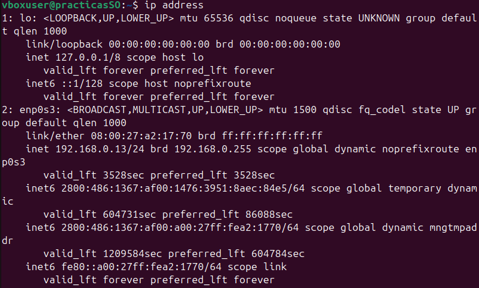

En nuestro dispositivo original en powershell ejecutamos la conexión ssh e ingresamos la contraseña del usuario

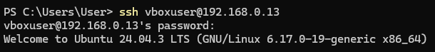

Localizamos los archivos dentro de la máquina virtual

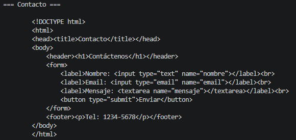

Iniciamos el servidor de la api con node js

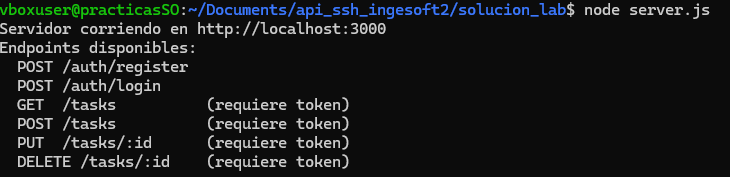

Instalamos powershell classic para poder ejecutar los comandos en ubuntu con la misma sintaxis de powershell

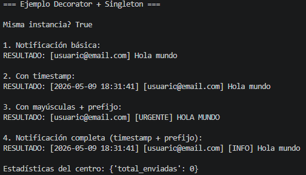

Iniciamos powershell en linux

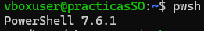

Creamos el usuario con la sintaxis dada

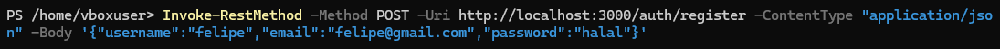

Obtenemos el token al hacer el login con el usuario creado anteriormente

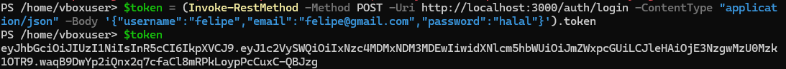

Creamos la tarea de prueba

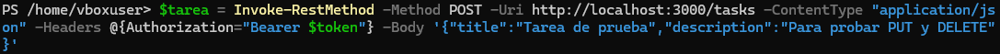

Modificamos el registro para poner la tarea nueva

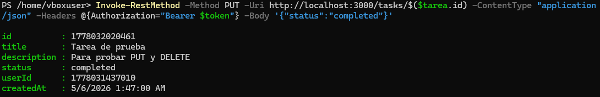

Ahora vamos a realizar la eliminación de la tarea

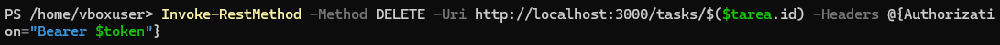

Para verificar que efectivamente se eliminó la tarea, consultamos todo el endpoint y observamos que se encuentra vacío

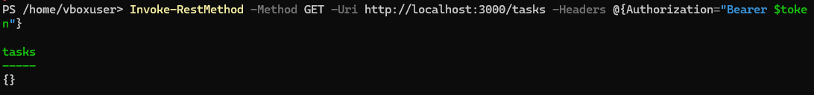